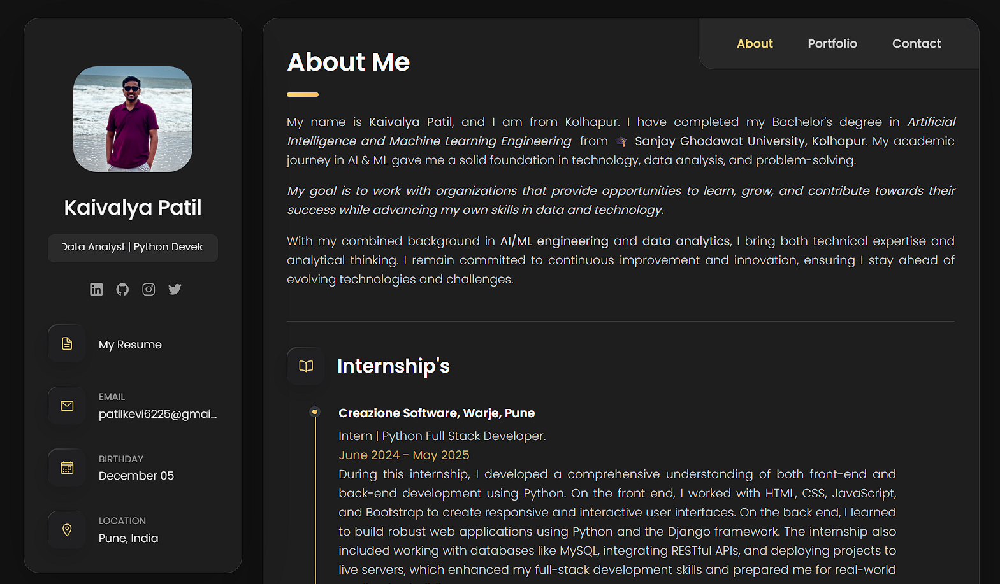

# 🌐 Personal Portfolio Website

A modern, responsive, and interactive personal portfolio website built using **HTML, CSS, and JavaScript** to showcase my profile, skills, projects, internship experience, resume, certifications, and contact information.

> Designed with a clean dark theme, smooth animations, responsive layout, and project filtering functionality.

---

## 🚀 Live Demo

🔗 https://patil-kaivalya.github.io/Portfolio_Website_of_KAIVALYA/

---

## 📸 Preview

<p align="center">
  
</p>

---

## ✨ Features

- 👤 Professional About Me section
- 💼 Internship & Education Timeline
- 🛠️ Technical Skills
- 📂 Project Portfolio with Category Filter
- 📱 Fully Responsive Design
- 🌙 Modern Dark UI
- 🎨 Smooth Animations
- 📄 Resume Download
- 📬 Contact Form
- 🔗 Social Media Links
- ⚡ Fast Loading Website

---

## 🛠️ Technologies Used

### Frontend

- HTML5
- CSS3
- JavaScript

### Icons

- Ionicons

### Fonts

- Google Fonts (Poppins)

---

## 📁 Project Structure

```
Portfolio_Website_of_KAIVALYA/
│
├── assets/
│   ├── css/
│   │   └── style.css
│   │
│   ├── js/
│   │   └── script.js
│   │
│   ├── images/
│   │
│   └── resume/
│
├── index.html
├── README.md
└── LICENSE
```

---

## 📂 Portfolio Sections

- About Me
- Internship
- Education
- Skills
- Projects
- Resume
- Contact

---

## 📚 Featured Projects

- 📊 E-Commerce Sales Dashboard (Power BI)
- 🚗 Driver Drowsiness Detection System
- 💰 Loan Prediction System
- 🤖 ChatBot
- 📝 Text Classification
- 🌐 Personal Portfolio Website
- 🖥️ Notepad Application
- 🚘 Car Price Prediction
- ❌ Tic Tac Toe Game
- 🏠 House Price Prediction

---

## 💻 Installation

Clone the repository

```bash
git clone https://github.com/patil-kaivalya/Portfolio_Website_of_KAIVALYA.git
```

Go to the project folder

```bash
cd Portfolio_Website_of_KAIVALYA
```

Open

```text
index.html
```

Or use VS Code Live Server.

---

## 📱 Responsive Design

The portfolio is optimized for:

- Desktop
- Laptop
- Tablet
- Mobile Devices

---

## 📬 Contact

**Kaivalya Patil**

📧 patilkevi6225@gmail.com

💼 LinkedIn  
https://www.linkedin.com/in/kaivalya-patil/

🐙 GitHub  
https://github.com/patil-kaivalya

---

## ⭐ Support

If you like this project, please consider giving it a ⭐ on GitHub.

---

## 📄 License

This project is licensed under the MIT License.

---

<p align="center">
Made with ❤️ by <b>Kaivalya Patil</b>
</p>
